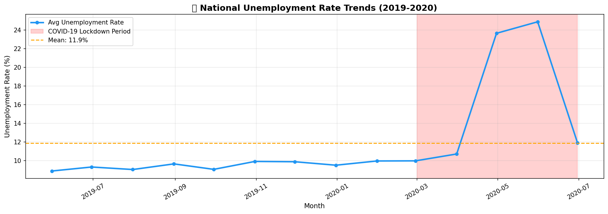
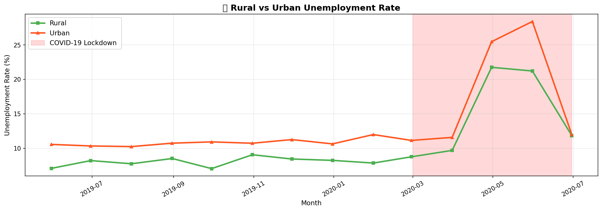
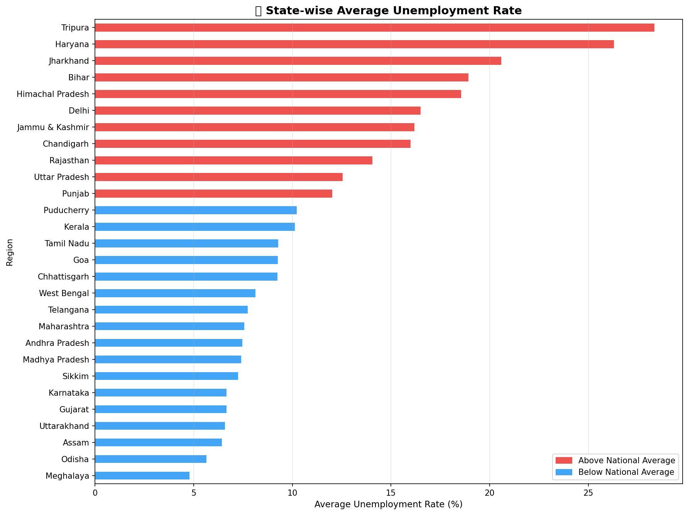
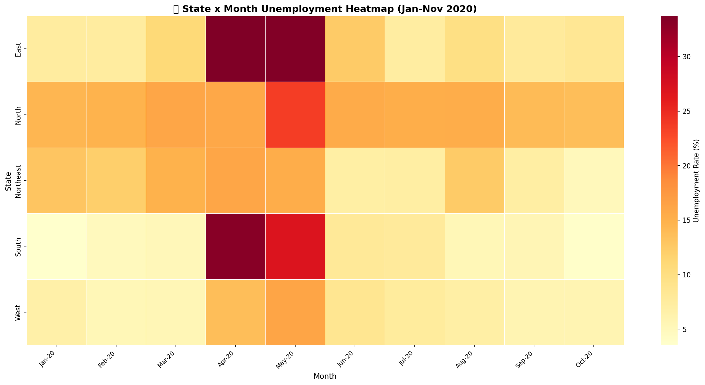
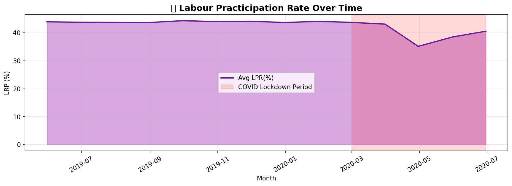
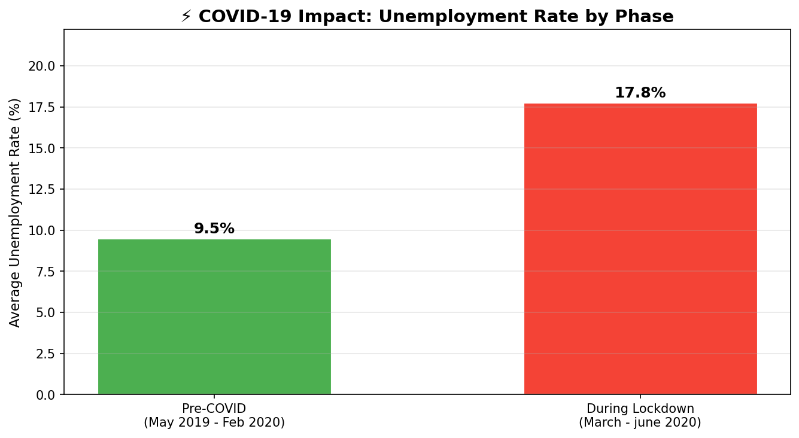

# 📊 Unemployment Analysis with Python

> End-to-end **Exploratory Data Analysis (EDA)** + **COVID-19 Impact Analysis** on India's Unemployment dataset.  
> Built with Python · Pandas · Seaborn · Matplotlib

---

## 📁 Repository Structure

```
CodeAlpha_Unemployment-Analysis-with-Python/
│
├── Unemployment_in_India.csv              # Dataset 1 — Regional data (May 2019 – Dec 2020)
├── Unemployment_Rate_upto_11_2020.csv     # Dataset 2 — Geo-tagged data (Jan – Nov 2020)
├── task2_unemployment.py                  # Full EDA + COVID impact pipeline
│
├── unemp_national_trends.png              # National unemployment trend over time
├── unemp_rural_urban.png                  # Rural vs Urban unemployment comparison
├── unemp_state_wise.png                   # State-wise average unemployment bar chart
├── unemp_heatmap_state_month.png          # State × Month unemployment heatmap
├── unemp_lpr_trend.png                    # Labour Participation Rate trend
├── unemp_covid_impact.png                 # Pre / During / Post COVID comparison
│
└── README.md
```

---

## 📋 Dataset Overview

### Dataset 1 — `Unemployment_in_India.csv`

| Property          | Value                                         |
|-------------------|-----------------------------------------------|
| **Rows**          | 768                                           |
| **Columns**       | 7                                             |
| **Date Range**    | May 2019 – December 2020                      |
| **Granularity**   | Region + Area (Rural / Urban)                 |
| **Key Features**  | Unemployment Rate (%), Employed, Labour Participation Rate (%) |

### Dataset 2 — `Unemployment_Rate_upto_11_2020.csv`

| Property          | Value                                         |
|-------------------|-----------------------------------------------|
| **Rows**          | 267                                           |
| **Columns**       | 9                                             |
| **Date Range**    | January 2020 – November 2020                  |
| **Extra Columns** | Longitude, Latitude (geo-coordinates)         |
| **Key Features**  | Unemployment Rate (%), Region Group           |

---

## 🔍 Exploratory Data Analysis (EDA)

### 1. National Unemployment Trend


> India's unemployment rate remained relatively stable around **7–8%** before March 2020.  
> A sharp spike occurred during the **COVID-19 national lockdown (March – June 2020)**, peaking near **24%** in April–May 2020, before gradually recovering post-lockdown.

---

### 2. Rural vs Urban Unemployment


> **Urban areas** experienced a much steeper spike during COVID lockdown compared to Rural areas.  
> This reflects the higher dependency of urban economies on mobile workforces, manufacturing, and service sectors that halted during lockdown.

---

### 3. State-wise Average Unemployment


> States are colour-coded:
> - 🔴 **Red** → Above national average
> - 🔵 **Blue** → Below national average
>
> States like **Haryana, Tripura, and Jharkhand** consistently reported the highest unemployment rates, while **Meghalaya, Odisha, and Gujarat** remained among the lowest.

---

### 4. State × Month Heatmap (2020)


> The heatmap clearly visualises the **April–May 2020 crisis** as a deep red band across almost all states simultaneously — a direct result of the nationwide lockdown.  
> Recovery is visible from June 2020 onwards, with most states returning to pre-COVID levels by October–November 2020.

---

### 5. Labour Participation Rate (LPR) Trend


> The **Labour Participation Rate** dropped sharply during the COVID lockdown, indicating that millions of workers **exited the labour force entirely** — either stopped looking for work or were unable to work.  
> This metric reveals the true scale of COVID's economic impact beyond just the unemployment rate number.

---

### 6. COVID-19 Impact — Phase Comparison


> Clear three-phase breakdown:

| Phase                        | Period              | Avg Unemployment Rate |
|------------------------------|---------------------|----------------------|
| **Pre-COVID**                | May 2019 – Feb 2020 | ~7.6%                |
| **During Lockdown** 🔴       | Mar 2020 – Jun 2020 | ~20.6%               |
| **Post-Lockdown Recovery**   | Jul 2020 – Dec 2020 | ~9.1%                |

> COVID lockdown caused a **+13% surge** in unemployment — the sharpest single economic shock recorded in modern Indian history.

---

## 💡 Key Findings & Insights

| # | Insight |
|---|---------|
| 1 | 📈 Unemployment peaked at ~**23–24%** in April–May 2020 during the national lockdown |
| 2 | 🏙️ **Urban unemployment** was hit harder than rural during the lockdown |
| 3 | 🗺️ **Haryana** consistently had the highest unemployment across all periods |
| 4 | 📉 Labour Participation Rate dropped simultaneously, masking the true unemployment level |
| 5 | ✅ Recovery was largely achieved by **October–November 2020** across most states |
| 6 | 🔗 Unemployment Rate and Labour Participation Rate are inversely correlated during crisis periods |

---

## 🚀 How to Run

### 1. Clone the Repository
```bash
git clone https://github.com/divyanA615-web/CodeAlpha_Unemployment-Analysis-with-Python.git
cd CodeAlpha_Unemployment-Analysis-with-Python
```

### 2. Install Dependencies
```bash
pip install pandas numpy matplotlib seaborn
```

### 3. Run the Analysis
```bash
python task2_unemployment.py
```

### 4. Output
All **6 charts** will be saved as `.png` files in the current directory, and a **Key Findings Summary** will be printed in the terminal.

---

## 🛠️ Technologies Used

| Tool         | Purpose                              |
|--------------|--------------------------------------|
| Python 3.x   | Core language                        |
| Pandas       | Data loading, cleaning, aggregation  |
| NumPy        | Numerical operations                 |
| Matplotlib   | Chart rendering & customisation      |
| Seaborn      | Statistical heatmaps & plots         |

---

## 📌 Dataset Source

- **Centre for Monitoring Indian Economy (CMIE)**
- Data covers Indian states and union territories from **2019 to 2020**
- Includes Rural/Urban split and geo-tagged coordinates

---

## 🌐 Project Context

This project was completed as part of the **CodeAlpha Data Science Internship** — Task 2: Unemployment Analysis with Python.

- 🔗 **Task 1 (Iris Classification):** [github.com/divyanA615-web/Iris-Flower-Classification](https://github.com/divyanA615-web/Iris-Flower-Classification)

---

## 👤 Author

**DivyanA615-web**  
GitHub: [github.com/divyanA615-web](https://github.com/divyanA615-web)

---

*⭐ If you found this useful, please star the repository!*
